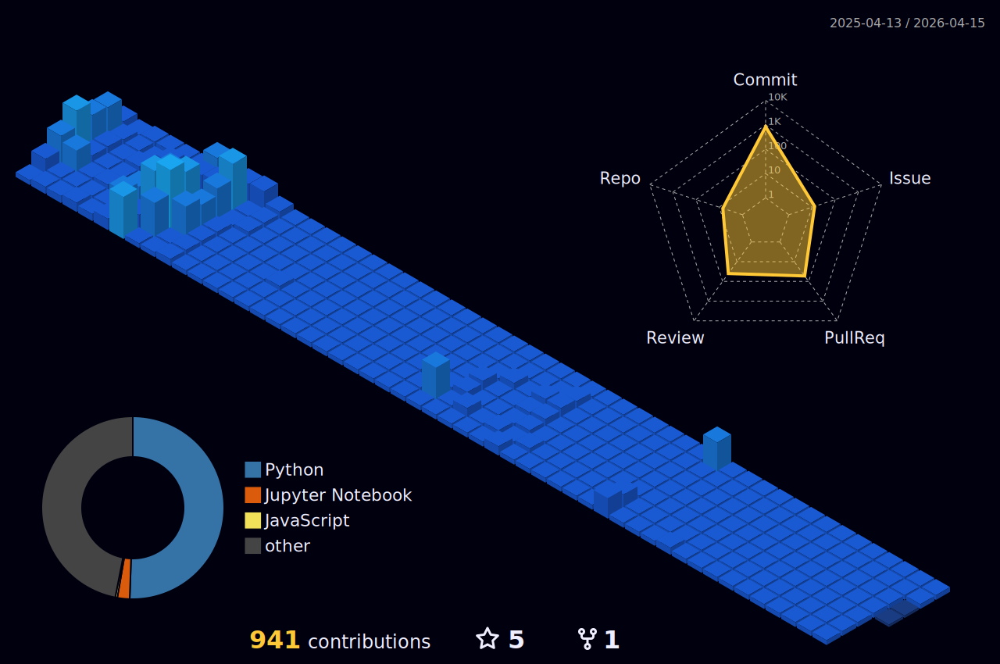

# 🚧아직 전체적으로 공사중입니다...!🚧
## 🧭 데이터애널리스트 꿈나무

### 🏫 Hanyang University ERICA
#### 👩‍🎓 Media Technology Undergraduate at Hanyang University ERICA(2021.03 - 2024.08)  

&nbsp;&nbsp;&nbsp;&nbsp;&nbsp;&nbsp;

  

#### 🥜 __산학 캡스톤 디자인 프로젝트__ 콘크리트 경화 과정에서의 굳기 정도를 활용한 **건설현장 안전사고 예방 플랫폼**  
**팀 하냥땅콩** 3인 개발 Software Developer Backend (2023.07 - 2024.06, 12 months)  
GitHub Repository: [hanyangcapstoneproject-peanut]https://github.com/HanyangCapstoneProject/peanut.git  
[중간 산출물] 기획 및 설계 발표 : [유튜브 영상](https://youtu.be/oOvU3STKEfo?si=o6t9rpWCAKjb8X2g)  
[최종 결과물1] 웹 사이트 배포 : [https://hanyangcapstoneproject.github.io/peanut/](https://hanyangcapstoneproject.github.io/peanut/)  
[최종 결과물2] 개발 문서 및 활동 내역 : [캡스톤 성과물 최종본.pdf](https://drive.google.com/file/d/1mugthVPKLWc73GlZAQCAa8stZRan9GG6/view?usp=sharing)  

 
 

### 🦿 Microsoft AI School 6기, 2024.12 ~  
&nbsp;&nbsp;&nbsp;&nbsp;&nbsp;&nbsp;

 

#### 🤓 __수업 실습__  
GitHub Repository : [MS-AI-Study](https://github.com/jooeun921/ms-ai-school.git)  

 

#### 🚘 __이미지 기반 자동차 번호판 인식 시스템__  
**팀 잡았다요놈🚨** : OCR 모듈 개발 및 개발모듈 통합 수행  
기간 : 2025.02.13 ~ 2025.02.26  
GitHub Repository : [License-Plate-Identification](https://github.com/kairosial/License-Plate-Identification.git)  
최종 발표자료 : [여기서 보기](https://drive.google.com/file/d/1zM274BRcRhh-zJG3OGaCtO12Qb-p75h2/view?usp=sharing)

<!--
### 🛠 Tech Stack  

---

-->
 

---

  <!-- Solved.ac 배지와 GitHub Streak 배지 - 같은 높이로 비율 유지 -->
  

    
    
  

  <!-- 3D 프로필 이미지와 Solve-nyang 배지 - 같은 높이로 비율 유지 -->
  

    
    
  

